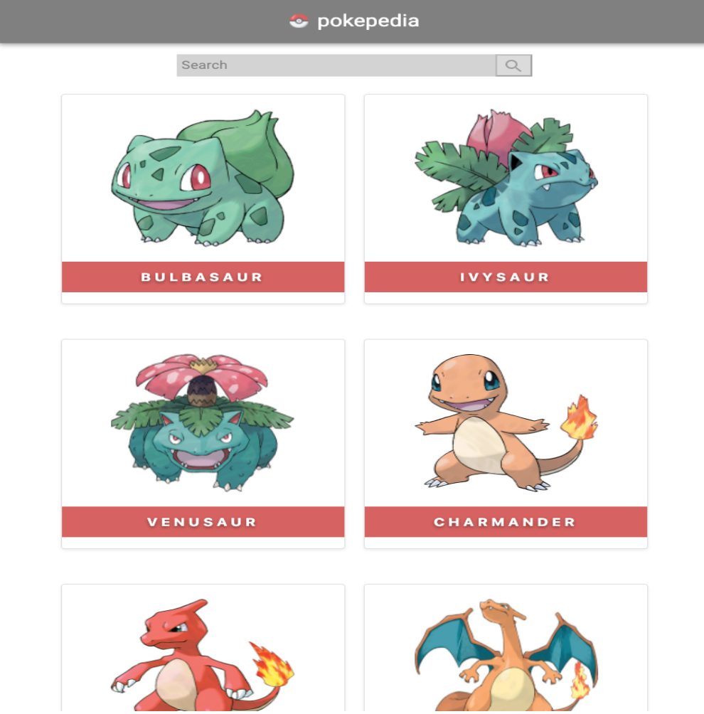
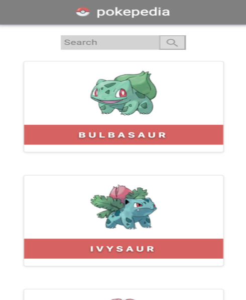

# pokepedia

pokepedia is a single page application that provides information about various species of Pokémon by using [GraphQL Pokémon](https://github.com/lucasbento/graphql-pokemon).

## Features
- Responsive on tablet, mobile, and desktop devices.
- Provides a search bar to search for a specific pokemon.
- Provides lookup autocompletion.
- Provides profile and evolution about a specific pokemon (when clicked).

### Desktop View

### Tablet View

### Mobile View

### Single Pokemon View

## Getting Started

These instructions will get you a copy of the project up and running on your local machine for development and testing purposes. See deployment for notes on how to deploy the project on a live system.

### Prerequisites

- You have installed the latest version of [Node.js and NPM](https://nodejs.org/en/).
- You have a Windows/Linux/Mac machine.

### Installing and using

To get acclimated, follow the steps below:

1. Fork and clone this repository.
2. Open a terminal and run npm install and then npm run start.

## Built With

* [npm](https://www.npmjs.com/) - The package manager used to manage the various dependencies.
* [React](https://reactjs.org/) - The JavaScript library used for building the user interface.
* [Material UI](https://material-ui.com/) - The framework used to design the user interface.
* [React-Router](https://reacttraining.com/react-router/) - The standard routing library for React that allows navigation without refreshing the page.
* [Sass](https://sass-lang.com/) - The stylesheet language compiled to CSS used for styling the application.
* [GraphQL](https://graphql.org/) - The query language used to communicate with the Pokémon API.
* [GraphQL Pokémon](https://github.com/lucasbento/graphql-pokemon) - The Pokémon API used.
* [ESlint](https://eslint.org/) - The tool used to maintain code quality.
* [Prettier](https://prettier.io/) - The tool used to format code.

## Versioning

We use [SemVer](http://semver.org/) for versioning. For the versions available, see the [tags on this repository](https://github.com/ahtae/pokepedia/tags).

## Authors

* **Kristy Li** - *Initial work* - [ahtae](https://github.com/ahtae)

See also the list of [contributors](https://github.com/ahtae/pokepedia/graphs/contributors) who participated in this project.

## License

This project is licensed under the MIT License - see the [LICENSE.md](https://github.com/ahtae/pokepedia/blob/master/LICENSE) file for details.
